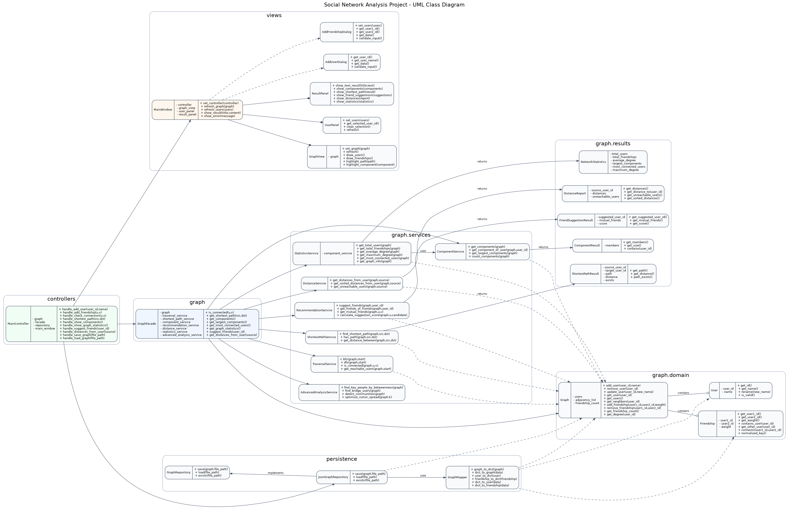

# Social Network Analysis Project

A simple data structures project for analyzing a social network as an undirected graph.

## UML Architecture

## Brief Overview

The project is organized into separate layers:

- **Domain**: core graph objects such as `User`, `Friendship`, and `Graph`.
- **Services**: graph algorithms such as traversal, shortest path, connected components, recommendations, distances, and statistics.
- **Results**: structured result objects returned by service classes.
- **Persistence**: saving and loading graph data using JSON.
- **Controller / Views**: application flow and Qt user interface.

At this stage, the project contains interface templates and TODO-based method skeletons for team members to implement later.
