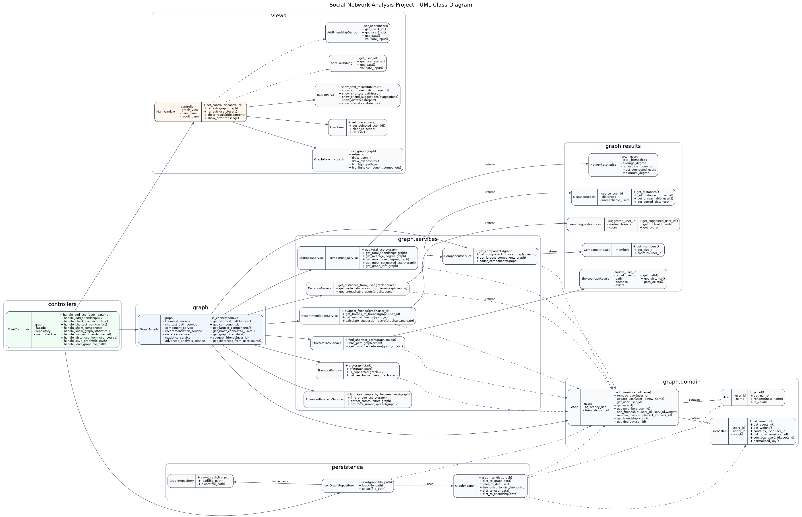

# Social Network Analysis Project

A data-structures project that models a social network as an undirected graph
and provides a Qt/QML interface for exploring it.

## Features

- Add, update, and remove users
- Add and remove friendships
- Check connectivity and find shortest paths
- Find connected components and the largest friendship group
- Suggest friends and calculate distances from a user
- Calculate network statistics
- Save and load graphs as JSON

## Architecture



The project is separated into layers:

- **Domain**: `User`, `Friendship`, and the adjacency-list `Graph`
- **Services**: traversal, paths, components, recommendations, distances, and statistics
- **Results**: structured result objects returned by analysis services
- **Persistence**: JSON graph storage
- **Facade / Controller / Views**: application coordination and the Qt/QML interface

## Installation and execution

Python 3.10 or newer is recommended.

```bash
python -m venv .venv
```

Activate the environment, then install the dependencies:

```bash
python -m pip install -r requirements.txt
python main.py
```

Saved graphs are stored in the repository's `data/` directory.

## Tests

Run the complete suite from the repository root:

```bash
python -m pytest -q
```

Run the connected-components and statistics tests only:

```bash
python -m pytest tests/test_components.py tests/test_statistics.py -v
```

## Data structures and algorithms

The graph uses an adjacency list. For `V` users and `E` friendships, its
storage complexity is `O(V + E)`.

### Connected components

`ComponentService` scans every user and starts an iterative depth-first search
(DFS) whenever it finds an unvisited user. Each DFS returns one connected
component. Isolated users form components of size one, and an empty graph has no
components.

Across the complete scan, each user is visited once and each undirected
friendship is inspected from both endpoints:

- Time: `O(V + E)`
- Auxiliary space: `O(V)` for the visited set, DFS stack, and results

Finding the largest component first computes all components and then compares
their sizes, so its overall complexity remains `O(V + E)`. If several
components have the same maximum size, all of them are returned.

### Network statistics

`StatisticsService` reports:

- total users `V`
- total friendships `E`
- average degree `2E / V` (or `0.0` for an empty graph)
- maximum degree
- every user tied for maximum degree
- every connected component tied for largest size

User and friendship counts are `O(1)`. Average degree is also `O(1)`.
Maximum-degree and most-connected-user queries scan users and their stored
degrees, while the complete report is dominated by connected-component
discovery and therefore runs in `O(V + E)`.

## Person C contribution

Person C owns connected-component analysis and network statistics. The related
implementation and tests are primarily located in:

- `graph/services/component_service.py`
- `graph/services/statistics_service.py`
- `tests/test_components.py`
- `tests/test_statistics.py`

The tests cover empty graphs, isolated users, cycles, multiple and tied largest
components, unknown users, degree ties, complete statistics results, and facade
integration.
